# Ephemera

*Named after the ephemeral rose the Little Prince tends on his tiny planet—something you love becomes important the moment you love it.*

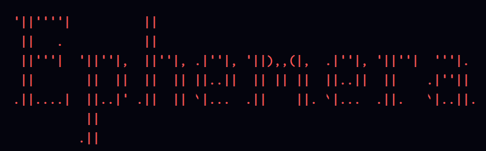

---
## The Ephemera Theme
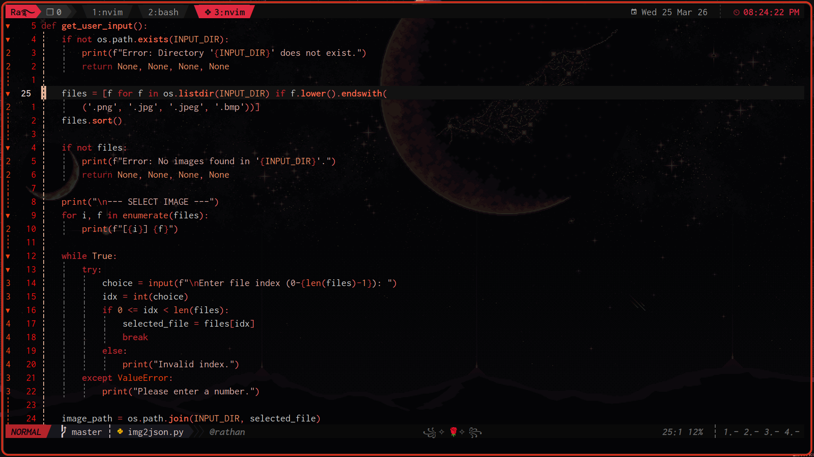

The Ephemera theme is a **deep, dark, moody** color scheme with:

- **Dark base** (`#04040d`) with muted warm grays (`#ddcccc`)
- **Red accents** for keywords, borders, and the signature rose (`#ff1e00`, `#ff5555`)
- **Glow effects** on functions and keywords for that ethereal feel
- **Transparency support** for floating windows
- **Custom highlights** for 50+ plugins (Telescope, Oil, CMP, LSP, etc.)

### Theme Features

| Feature | Description |
|---------|-------------|
| `transparent` | Toggle transparent backgrounds with `:ToggleTransparency` |
| `glow` | Bold highlights with glow color on functions/keywords |
| `show_end_of_buffer` | Toggle end-of-buffer visibility |

### Color Palette Highlights

```
 Reds:    #ff0000, #ff4444, #ff5555 (light), #ff6347 (tomato)
 Greens:  #00ff99, #50fa7b, #73daca
 Blues:   #00e1ff, #61afef, #7aa2f7
 Purples: #ff00ff, #bd93f9, #c678dd
 Oranges: #ff9e64, #ff8800, #f59064
```

---

## Directory Structure

```
nvim/
├── init.lua                          # Entry point - loads Ephemera config
└── lua/
    └── Ephemera/
        ├── init.lua                 # Main module - loads all components
        ├── options.lua              # Neovim settings (folding, ui, etc.)
        ├── lazy.lua                # Plugin manager bootstrap
        ├── keybinds.lua            # All global keybindings
        ├── commands.lua            # Autocommands & user commands
        ├── welcome.lua             # Custom welcome screen with rose
        ├── statusLine.lua          # Custom statusline with animations
        ├── pluginConfig.lua        # LSP, CMP, Treesitter configs
        ├── scratchpad.lua          # Temporary scratch buffer
        ├── notepad.lua             # File-based note system
        ├── themePicker.lua         # Telescope-based theme selector
        ├── themes/                 # Theme definitions
        │   ├── current.lua         # Currently active theme
        │   ├── Ephemera.lua        # The Ephemera theme
        │   └── [50+ themes]       # rosepineDark, tokyonight, etc.
        ├── plugins/                # Plugin configurations
        │   ├── Aerial.lua
        │   ├── editing.lua
        │   ├── games.lua
        │   ├── languageServer.lua
        │   ├── miscellaneous.lua
        │   ├── navigation.lua
        │   ├── notes.lua
        │   ├── treesitter.lua
        │   └── versionControl.lua
        └── notes/                  # Note files directory
```

---

## File Explanations

### `init.lua`
The entry point that loads the entire Ephemera configuration module.

### `init.lua` (in `lua/Ephemera/`)
The main module that orchestrates loading:
1. `options.lua` - Global vim settings
2. `lazy.lua` - Plugin manager (lazy.nvim)
3. `keybinds.lua` - Keybindings
4. Theme loading
5. `welcome.lua` - Welcome screen
6. `statusLine.lua` - Statusline
7. `pluginConfig.lua` - Plugin configurations
8. `commands.lua` - Autocommands and user commands
9. `scratchpad.lua` & `notepad.lua` - Scratch and notes

### `options.lua`
Core Neovim settings including:
- Leader keys, mouse, timeout
- Numbering, relative numbers
- Tabs (4 spaces), expandtab
- Folding (treesitter-based)
- Custom fold text with line count percentage
- Signs for diagnostics

### `lazy.lua`
Bootstrap and configuration for **lazy.nvim** plugin manager.

### `keybinds.lua`
All global keybindings (see Keymaps section).

### `commands.lua`
Autocommands and user commands:
- FileType detection (.sv → systemverilog, .v → verilog)
- `:ReloadConfig` - Reload configuration
- `:SetStatus` - Set statusline message
- `:HarpoonClr` / `:HarpoonOnly` - Harpoon buffer management
- `:LockIn` - Typewriter mode (cursor lock)
- `:ToggleStatusLine` - Toggle statusline visibility
- `:Ephemera` - Main command (theme, nnote, onote)

### `welcome.lua`
Custom welcome screen featuring:
- ASCII art header ("Ephemera" branding)
- Quote display
- Quick action buttons
- **ASCII rose flower** on the right side
- All movement keys blocked for focused interaction
- Responsive layout (rose hides on narrow windows)

### `statusLine.lua`
Custom statusline with:
- Mode indicator (NORMAL, INSERT, VISUAL, etc.)
- Git branch display
- Filename with icons
- Modified indicator
- **Cycling stat sections** (`\`) - position, diagnostics, LSP, filetype
- **Cycling additional sections** (`|`) - harpoon tabs, key logger, clock
- **Animation engine** with cute cat frames
- Key logger showing recent keys pressed
- Dynamic highlight bridging

### `pluginConfig.lua`
Configuration for:
- **Mason** - LSP installer
- **LSP** - Language server protocols (clangd, jdtls, verible, arduino)
- **CMP** - Completion engine
- **Treesitter** - Syntax highlighting
- **JDTLS** - Java development
- **Venn.nvim** - Visual box selection

### `scratchpad.lua`
Temporary buffer for quick notes:
- `:Scratchpad.open()` - Open/toggle scratch buffer
- `:Scratchpad.close()` - Close scratch buffer
- `:Scratchpad.clone()` - Clone current buffer to scratch
- `:Scratchpad.yank()` - Yank scratch contents

### `notepad.lua`
File-based note system:
- Notes stored in `lua/Ephemera/notes/`
- `.gnote` file extension
- Telescope picker for browsing notes
- Quick access to global note

### `themePicker.lua`
Telescope-based theme selector:
- Live preview while browsing
- Themes stored in `themes/` directory
- Persists selection to `themes/current.lua`

---

## Keymaps

### Leader Key
```
<leader> = " " (space)
```

### Insert Mode Cursor Movement
| Key | Action |
|-----|--------|
| `<A-h>` | Move left |
| `<A-l>` | Move right |
| `<A-j>` | Move down |
| `<A-k>` | Move up |
| `<A-o>` | New line below |
| `<A-O>` | New line above |

### General Editing
| Key | Action |
|-----|--------|
| `<leader>y` | Copy to system clipboard |
| `<leader>p` | Paste from system clipboard |
| `<leader>d` | Duplicate current line |
| `<leader>dd` | Copy line below |
| `<leader>tn` | Temporary normal mode |
| `J` | Move line down (visual) |
| `K` | Move line up (visual) |
| `H` | Go to line start |
| `L` | Go to line end |
| `ct` | Change inner tag |
| `vt` | Visual inner tag |
| `<A-=>` | Insert ` := ` |

### Search & Navigation
| Key | Action |
|-----|--------|
| `<leader>ff` | Find files (Telescope) |
| `<leader>fg` | Live grep (Telescope) |
| `<leader>fb` | Buffers (Telescope) |
| `<leader>fh` | Help tags (Telescope) |
| `<leader>fgi` | Git files |
| `<leader>gr` | Grep string |
| `<leader>gq` | Grep to quickfix |
| `n` / `N` | Search with centering |
| `<C-d>` / `<C-u>` | Scroll with centering |
| `[c` | Treesitter context |

### Windows & Splits
| Key | Action |
|-----|--------|
| `<leader>h` | Horizontal split |
| `<leader>v` | Vertical split |
| `<A-h>` | Move to left window |
| `<A-l>` | Move to right window |
| `<C-j>` | Move down |
| `<C-k>` | Move up |
| `<C-Up>` | Resize +2 |
| `<C-Down>` | Resize -2 |
| `<C-Left>` | Vertical resize -2 |
| `<C-Right>` | Vertical resize +2 |

### Harpoon (Buffer Marking)
| Key | Action |
|-----|--------|
| `<leader>a` | Add buffer to harpoon |
| `<leader>s` | Remove from harpoon |
| `<leader>1-4` | Jump to harpoon 1-4 |
| `<A-[>` | Previous harpoon |
| `<A-]>` | Next harpoon |
| `<leader>e` | Harpoon picker |

### Files
| Key | Action |
|-----|--------|
| `<leader>nf` | Create new file |
| `<leader>pv` | Netrw explorer |
| `<leader>x` | Open dir with xdg-open |
| `<leader>xx` | Open with custom app |
| `<leader>X` | Open dir with custom app |
| `<C-P>` | Copy relative path |

### LSP
| Key | Action |
|-----|--------|
| `K` | Hover documentation |
| `gd` | Go to definition |
| `gD` | Go to declaration |
| `gi` | Go to implementation |
| `go` | Go to type definition |
| `gr` | References |
| `gs` | Signature help |
| `<F2>` | Rename |
| `<F3>` | Format |
| `<F4>` | Code actions |

### Terminal
| Key | Action |
|-----|--------|
| `<leader>t` | Floating terminal |
| `<leader>r` | Make run with args |
| `<leader>tt` | Split terminal |

### Git
| Key | Action |
|-----|--------|
| `<leader>gs` | Git fugitive |
| `<leader>gg` | Toggle GitGutter |
| `<leader>gt` | Toggle git line highlights |

### Scratchpad & Notes
| Key | Action |
|-----|--------|
| `<leader>ss` | Open scratchpad |
| `<leader>sq` | Close scratchpad |
| `<leader>sp` | Clone to scratchpad |
| `<leader>sy` | Yank scratchpad |
| `<leader>gn` | Open global note |
| `<leader>nn` | Toggle notepad |

### Special Features
| Key | Action |
|-----|--------|
| `<leader>i` | Smart toggle (true/false, on/off, etc.) |
| `<leader>vn` | Toggle venn (visual box selection) |
| `<leader>fo` | Format with conform |
| `<leader>cp` | Toggle Copilot |
| `<leader>u` | Toggle Undotree |
| `<leader>rw` | Replace word |
| `<leader>m` | Toggle minimap |
| `<leader>fn` | Toggle fidget |
| `<leader>un` | Dismiss notifications |
| `]]]` | Print current directory |

### Statusline
| Key | Action |
|-----|--------|
| `\` | Cycle stat section |
| `\|` | Cycle additional section |

### Statusline Animation Modes
```
:SlAnimMode time [ms]     - Animated cat (default 200ms)
:SlAnimMode input         - On cursor move
:SlAnimMode static [1-9]  - Static decorations
```

### Quick Actions (Welcome Screen)
| Key | Action |
|-----|--------|
| `n` | New File |
| `l` | Last File |
| `e` | Explorer (Oil) |
| `f` | Find File |
| `r` | Recent files |
| `c` | Config |
| `q` | Quit |

---

## Commands

### General
| Command | Description |
|---------|-------------|
| `:ReloadConfig` | Reload configuration |
| `:ToggleStatusLine` | Toggle statusline |
| `:LockIn` | Typewriter cursor lock |
| `:ToggleTransparency` | Toggle theme transparency |
| `:ToggleCompletion` | Toggle completion engine |

### Ephemera Commands
| Command | Description |
|---------|-------------|
| `:Ephemera theme` | Open theme picker |
| `:Ephemera nnote <name>` | Create/open named note |
| `:Ephemera onote` | Open notes picker |

### Status Messages
| Command | Description |
|---------|-------------|
| `:SetStatus text <msg>` | Set statusline text |
| `:SetStatus msg <key>` | Set predefined message (wtf, ok, error, busy) |
| `:SetStatus aerial` | Show aerial symbols |

### Harpoon
| Command | Description |
|---------|-------------|
| `:HarpoonClr` | Clear all harpoon marks |
| `:HarpoonOnly` | Keep only harpoon buffers |

---

## Plugins

### Core
| Plugin | Purpose |
|--------|---------|
| lazy.nvim | Plugin manager |

### Navigation
| Plugin | Purpose |
|--------|---------|
| telescope.nvim | Fuzzy finder |
| harpoon2 | Buffer marking |
| oil.nvim | File explorer |

### Editing
| Plugin | Purpose |
|--------|---------|
| nvim-surround | Surround operations |
| mini.move | Move text |
| flash.nvim | Motion/jump |
| nvim-ts-autotag | Auto close/rename tags |
| emmet-vim | Emmet expansion |

### LSP & Language
| Plugin | Purpose |
|--------|---------|
| nvim-lspconfig | LSP configuration |
| mason.nvim | LSP installer |
| nvim-cmp | Completion |
| treesitter | Syntax highlighting |

### Version Control
| Plugin | Purpose |
|--------|---------|
| vim-fugitive | Git commands |
| gitsigns.nvim | Git signs |

### UI
| Plugin | Purpose |
|--------|---------|
| nvim-web-devicons | File icons |
| nvim-notify | Notifications |
| aerial.nvim | Code outline |
| indent-blankline | Indent guides |

### Utilities
| Plugin | Purpose |
|--------|---------|
| undotree | Undo history |
| which-key | Key hints |
| refactoring.nvim | Refactoring |
| camoufluage.nvim | Text camouflage |

---

## Welcome Screen

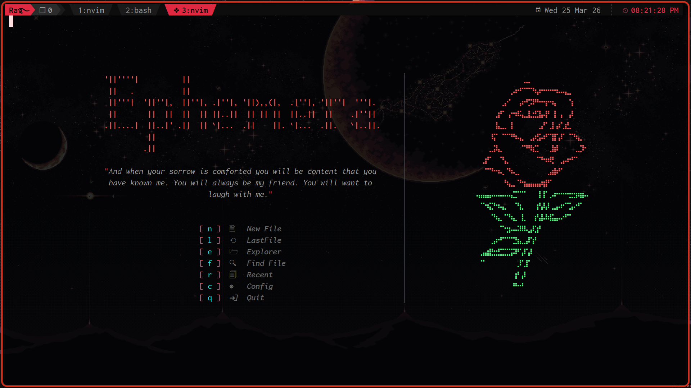

The welcome screen appears on startup (when no files are opened). Inspired by the Little Prince, it features:

- **ASCII Header**: Ephemera branding
- **Quote**: "And when your sorrow is comforted you will be content that you have known me."
- **Rose Art**: 19-line ASCII flower (red petals, green stem)
- **Quick Actions**: Single-key navigation
- **Keyblocked**: All movement keys blocked for focused interaction
- **Responsive**: Rose hides on narrow windows

---

## Customization

### Changing Theme
```vim
:Ephemera theme
```
Or manually edit `lua/Ephemera/themes/current.lua`:
```lua
return { name = "tokyonight" }
```

### Toggle Transparency
```vim
:ToggleTransparency
```

### Statusline Animation
```vim
:SlAnimMode time 200    " Animated cat
:SlAnimMode input       " On cursor move
:SlAnimMode static 1    " Static decoration
```

---

## Screenshots

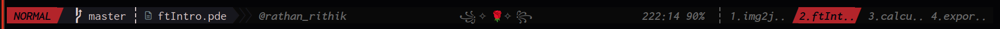
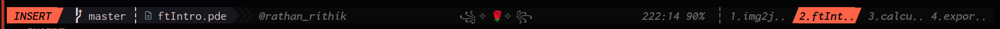
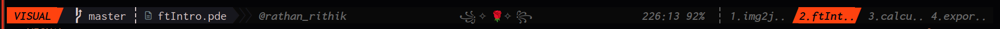

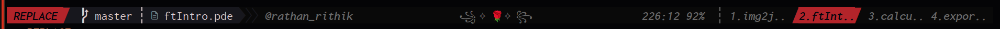
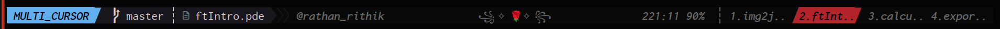
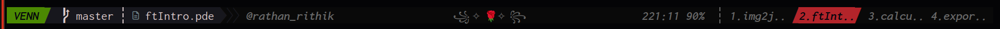

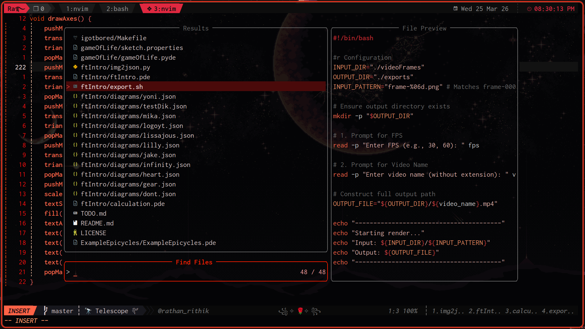

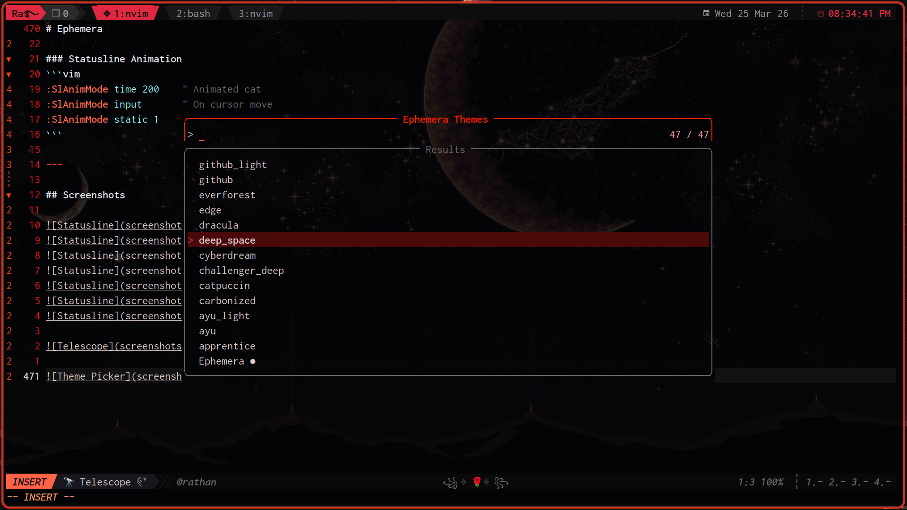
